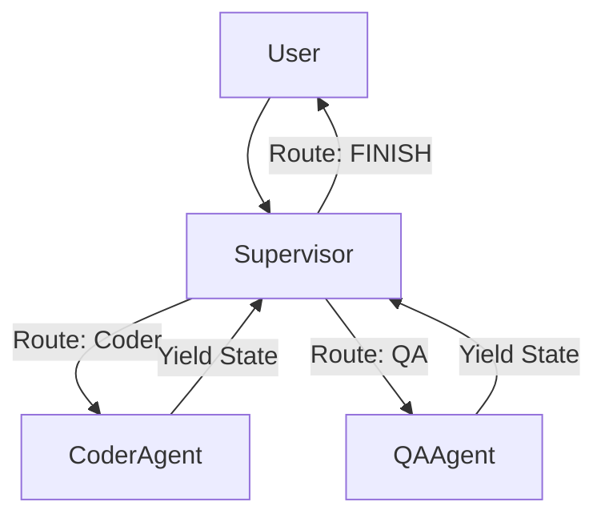

# Agent Architecture

AIForge orchestrates autonomous agents using **LangGraph**, representing workflows as stateful, cyclic graphs rather than static chains.

## Supervisor Router Paradigm
Instead of a single monolithic agent attempting to execute dozens of tools, AIForge utilizes a Hierarchical Swarm topology.

1.  **Supervisor Node:** An LLM dedicated purely to analyzing the current `MessagesState` and deciding *which* specialist agent should act next.
2.  **Specialist Nodes:** Narrowly scoped agents (e.g., `CodeWriter`, `DataAnalyst`) with access only to the tools required for their specific domain.

## State Management
Agents do not maintain independent memory. All context is centrally managed via a TypedDict (`MessagesState`) which is appended to by each node and durably persisted to PostgreSQL via LangGraph's `PostgresSaver` checkpointer.

## Loop Protection
Autonomous agents are prone to hallucinating infinite conversational loops. AIForge mitigates this via the `max_loops` integer on the `Swarm` object. The `SwarmExecutor` acts as a circuit breaker, physically terminating the graph execution if the loop threshold is breached.
