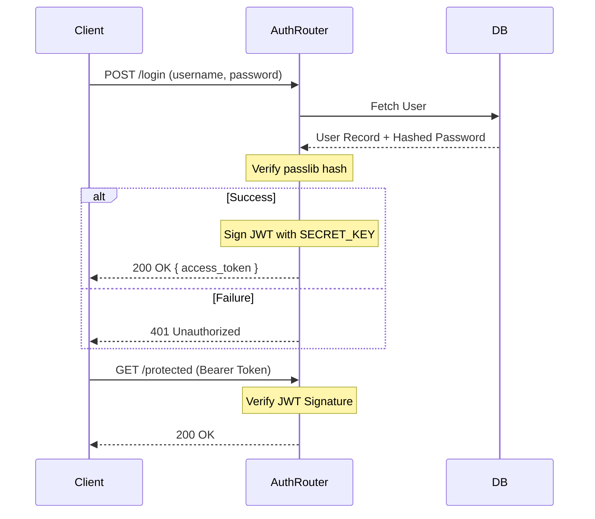

# Authentication Architecture

AIForge utilizes stateless JSON Web Tokens (JWT) for authentication, relying on the OAuth2 Password Bearer flow.

## Authentication Flow



## JWT Payload Structure
The JWT payload inherently binds the user to a specific tenant to prevent multi-tenant data leaks.
```json
{
  "sub": "user_id_uuid",
  "tenant_id": "tenant_id_uuid",
  "role": "admin",
  "exp": 1718000000
}
```

## Security Posture
*   **Algorithms:** RS256 or HS256 (configurable).
*   **Expirations:** Access tokens expire every 30 minutes. Refresh tokens expire in 7 days.
*   **Revocation:** Stateless JWTs cannot be easily revoked. A Redis-based JWT blocklist is planned for Phase 3 to handle immediate user terminations.
