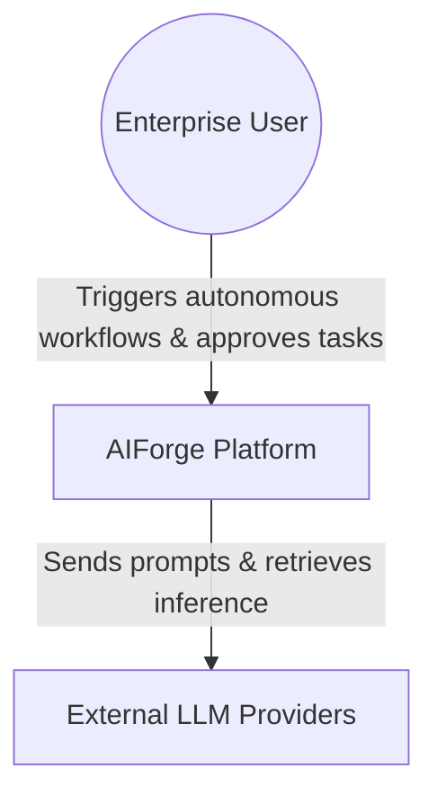
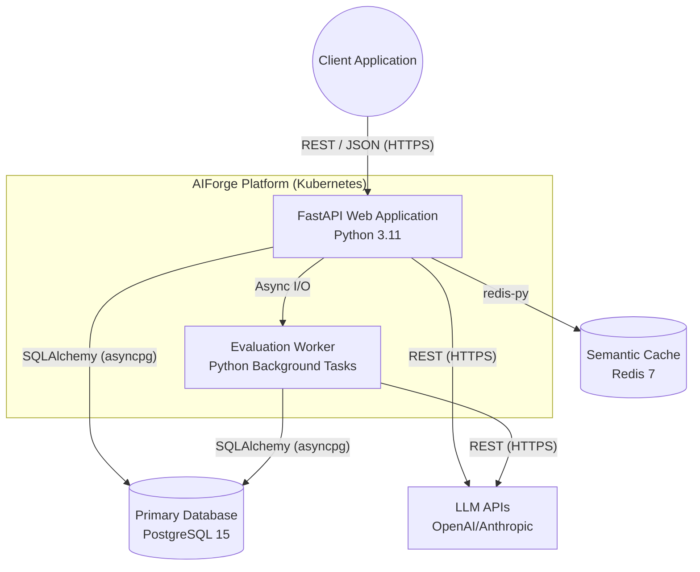
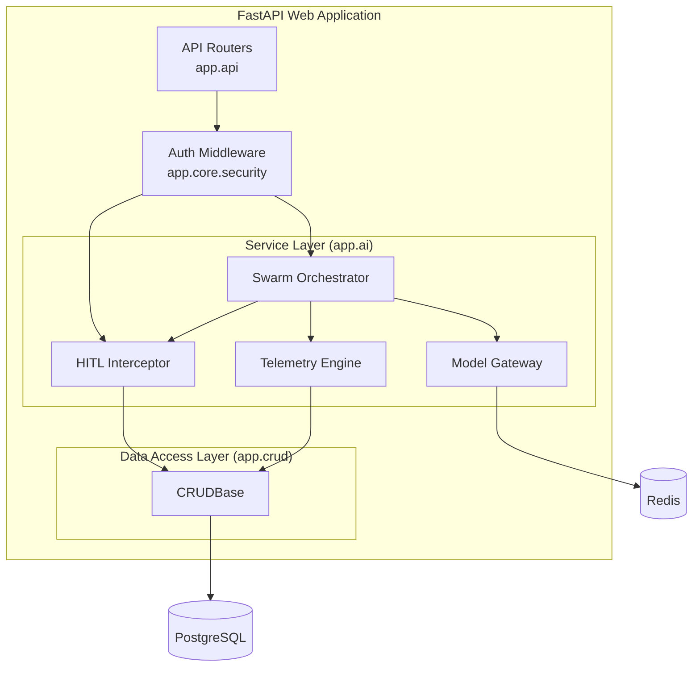

# C4 Architecture Model

This document provides a C4 (Context, Containers, Components) model visualization of the AIForge system to explain the architecture across different levels of abstraction.

## Level 1: System Context Diagram

The System Context diagram shows how AIForge fits into the broader enterprise environment and how users interact with it.

## Level 2: Container Diagram

The Container diagram zooms into the AIForge Platform to show the high-level deployable units and data stores.

## Level 3: Component Diagram (FastAPI Application)

This diagram zooms into the FastAPI Web Application container to show the structural building blocks of the codebase.

