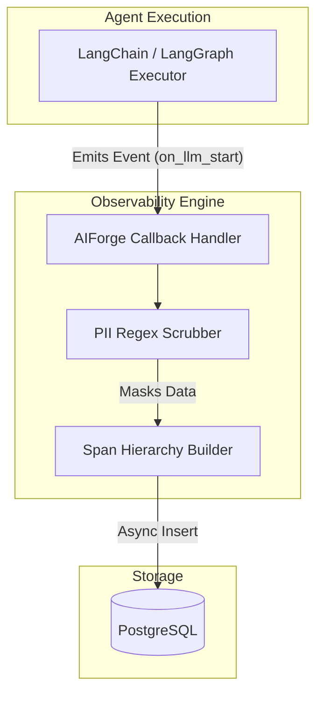
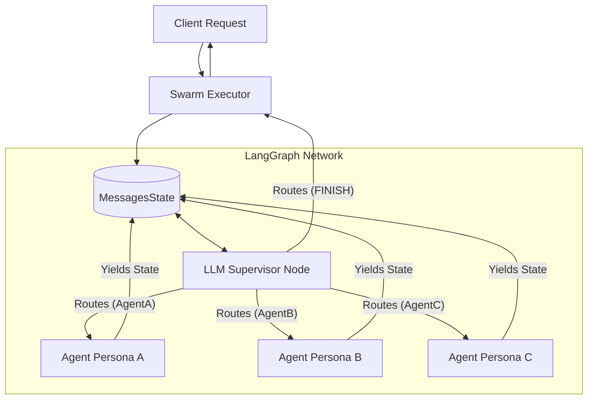
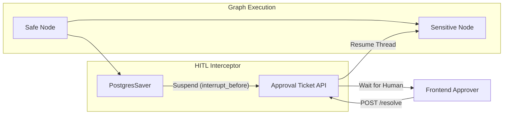

# Component Diagrams

This document visually details the internal structure and responsibilities of the core subsystems within AIForge.

## 1. Observability Engine Component

The Observability Engine is responsible for capturing, scrubbing, and persisting telemetry data from active agent runs without blocking the main execution thread.

## 2. Multi-Agent Swarm Component

The Swarm component orchestrates the routing logic between specialized agents using a shared state object.

## 3. Human-In-The-Loop (HITL) Component

The HITL component safely suspends and resumes execution based on manual human approval.

