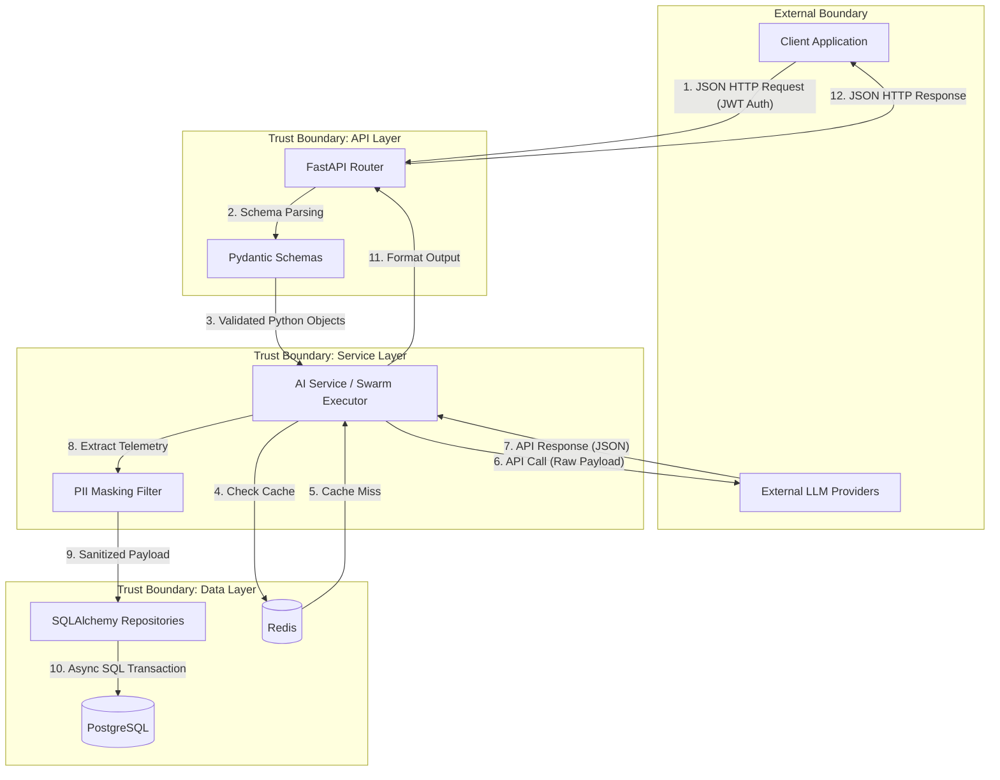

# Data Flow Diagram

This document traces the flow of data through AIForge, emphasizing trust boundaries, data transformations, and storage interactions.

## Core Data Flow

The AIForge architecture operates on a strict layered model. Data flows sequentially through the API, Service, and Data Access Layers, never bypassing intermediate stages.

## Data Lifecycle & Security Transformations

1.  **Ingress:** External data enters as raw JSON. FastAPI immediately converts this to strict Python types using Pydantic models. Any invalid data (e.g., missing required fields, type mismatches) is rejected at the perimeter with a `422 Unprocessable Entity`.
2.  **Authentication Filter:** Before reaching the Service Layer, the JWT middleware extracts the `tenant_id` and `user_id`. These parameters are rigidly passed downward to ensure isolation.
3.  **Third-Party Egress:** Before hitting external LLMs, the Model Gateway formats the data into the specific vendor's required payload (e.g., OpenAI vs Anthropic message formats).
4.  **Telemetry Sanitization (Scrubber):** Before saving agent thoughts or prompt inputs to the database, the `AIForgeTracer` applies regex-based masking to remove sensitive data (e.g., replacing credit card numbers with `[REDACTED_CC]`).
5.  **Persistence:** The CRUD layer receives the sanitized, tenant-bound data and uses SQLAlchemy models to generate asynchronous parameterized SQL queries, protecting against SQL injection, before committing to PostgreSQL.
