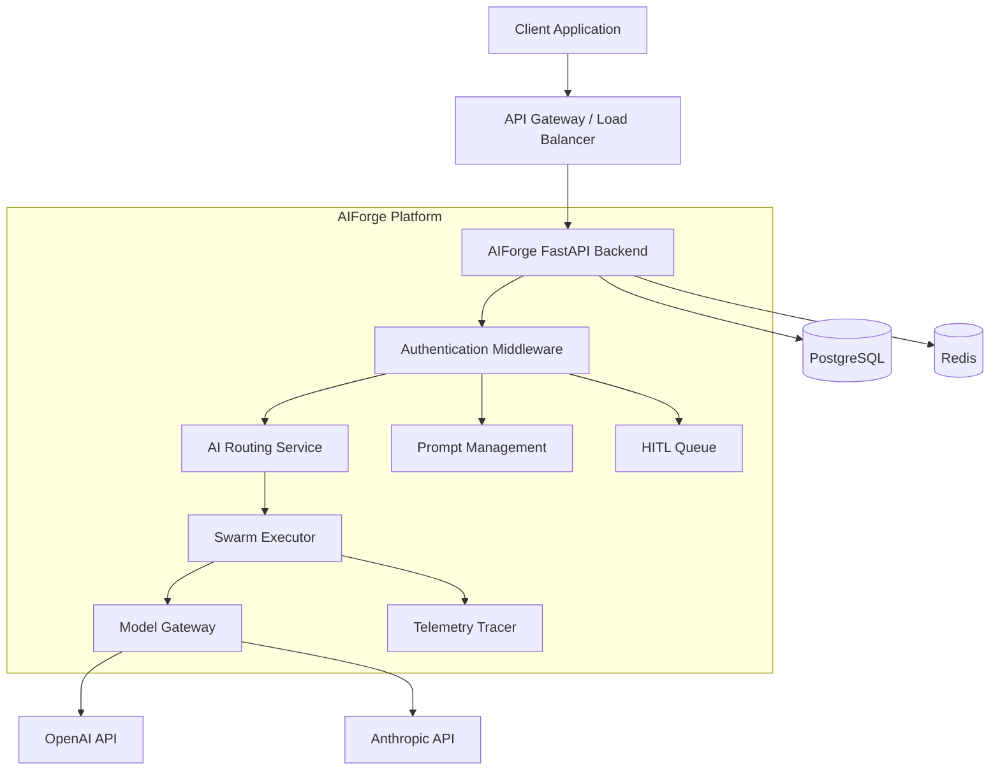

# High Level Design (HLD)

## Business Context
AIForge is built to transition Large Language Models (LLMs) from experimental wrapper scripts into governable, enterprise-ready software. Organizations are struggling to deploy autonomous AI agents due to risks involving data privacy, unpredictable outputs, and runaway API costs. AIForge provides a strict architectural boundary that enforces tenant isolation, observes agent telemetry, and mandates human-in-the-loop approvals for sensitive actions.

## Functional Requirements
*   **LLM Abstraction:** The system must route requests dynamically between multiple providers (e.g., OpenAI, Anthropic) without requiring client-side code changes.
*   **Prompt Governance:** Prompts must be versioned, immutable, and deployed via a Maker/Checker workflow.
*   **Agent Execution:** The system must execute multi-step agent topologies (Swarms) while maintaining state across iterative cycles.
*   **Evaluation:** The system must asynchronously evaluate agent outputs against predefined "Golden Datasets".
*   **HITL (Human-in-the-Loop):** The system must pause autonomous workflows when reaching sensitive nodes and await human approval.

## Non-Functional Requirements
*   **Multi-Tenancy:** Absolute logical separation of data; no cross-tenant data access is permissible.
*   **Determinism:** LangGraph checkpointers must allow exact state reproduction for debugging.
*   **Scalability:** Must support high-concurrency async operations and offload heavy background tasks to distributed queues.
*   **Latency:** Model Gateway routing logic must add < 50ms overhead to standard LLM API calls.
*   **Security:** PII must be scrubbed before hitting any database layer.

## Architecture Overview
AIForge utilizes a service-oriented backend architecture exposed via FastAPI, backed by PostgreSQL for persistent state and Redis for distributed caching.

## Major Subsystems
1.  **Model Gateway (`/gateway`):** Handles provider abstraction, semantic caching, and token usage tracking.
2.  **Swarm Orchestrator (`/swarms`):** Manages the LangGraph state machine, enforcing `max_loops` and routing messages via the Supervisor node.
3.  **Observability Engine (`/observability`):** Intercepts LangChain callbacks, strips PII via regex matching, and persists hierarchical span traces.
4.  **Evaluation Framework (`/evaluations`):** Executes asynchronous `LLMJudge` tasks to compare new prompts against historical golden data.

## External Integrations
*   **LLM Providers:** OpenAI, Anthropic (via HTTP/REST REST APIs).
*   **Identity Provider (Future):** Currently uses internal OAuth2, designed to integrate with Okta/Auth0.

## User Journeys
1.  **Prompt Deployment:** AI Engineer drafts Prompt -> Submits for Review -> Lead Engineer Approves -> Prompt Deployed to active status.
2.  **Autonomous Task:** Client triggers Swarm -> Swarm iterates -> Swarm hits "Send Email" tool -> Intercepted -> Ticket created -> Human Approves -> Swarm finishes -> Final output returned.

## Scaling Strategy
The FastAPI service is stateless (JWT auth) and scales horizontally. State is managed entirely by Postgres (for LangGraph checkpointers and entity data) and Redis (for semantic caching and rate limiting). Heavy background workloads (evaluations) are currently using FastAPI `BackgroundTasks`, but the architecture mandates a migration to Celery/RabbitMQ for horizontal worker scaling.

## Security Overview
*   All endpoints enforce `tenant_id` extraction from the decoded JWT.
*   Database rows are strictly scoped by tenant.
*   Tool execution environments are isolated and mocked during `Replay` mode.
