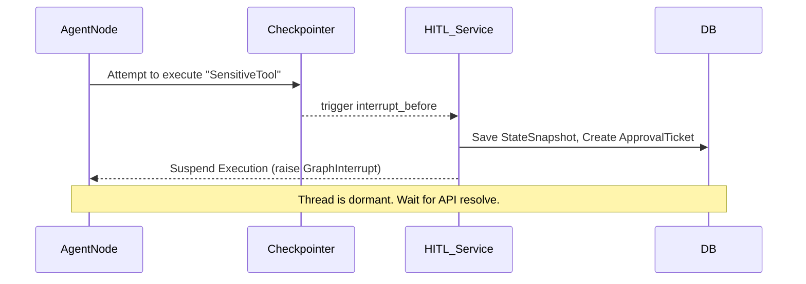

# Low Level Design (LLD)

## Module Breakdown

### 1. `app.api` (Routers)
*   **Responsibility:** HTTP request parsing, Pydantic schema validation, JWT extraction, and dependency injection (Database Sessions, Current User).
*   **Key Modules:** `auth.py`, `gateway.py`, `hitl.py`, `swarms.py`.
*   **Rule:** Absolutely no business logic or database queries exist in this layer. It acts strictly as an I/O boundary.

### 2. `app.crud` (Data Access Layer)
*   **Responsibility:** Execution of asynchronous SQLAlchemy 2.0 statements.
*   **Key Modules:** `base.py` (generic `CRUDBase`), `crud_swarms.py`, `crud_hitl.py`.
*   **Rule:** Every operation must explicitly filter by `tenant_id` to enforce multi-tenancy.

### 3. `app.ai` (Core Service Layer)
*   **Responsibility:** Execution of complex AI logic, LangGraph orchestration, and third-party API integration.
*   **Key Modules:**
    *   `/gateway`: Implements `BaseProvider` and dynamic failover logic.
    *   `/observability`: Implements custom `BaseCallbackHandler` for LangChain to track token usage and latency.
    *   `/swarms/executor.py`: Instantiates LangGraph state machines and manages cyclic execution.

## Service Responsibilities & Interfaces

### Model Gateway Interface
```python
class BaseProvider(ABC):
    @abstractmethod
    async def generate(self, prompt: str, **kwargs) -> tuple[str, dict]:
        pass
```
*   **OpenAIProvider:** Implements `BaseProvider`. Handles token calculation specific to `tiktoken`.
*   **AnthropicProvider:** Implements `BaseProvider`.

### Swarm Orchestration Workflow
1.  **State Definition:** The swarm state is tracked via a TypedDict (e.g., `MessagesState`).
2.  **Supervisor Node:** The `SupervisorRouter` acts as the entry node. It is an LLM call that outputs structured JSON denoting the `next_agent_id` or `FINISH`.
3.  **Worker Nodes:** Executed dynamically based on Supervisor routing. Upon completion, state is appended, and execution yields back to the Supervisor.

## Internal Workflows: HITL Interruption



## Validation Rules & Error Handling
*   **Input Validation:** Pydantic `v2` is used for all incoming REST payloads.
*   **Database Constraints:** SQLAlchemy enforces uniqueness (e.g., `PromptDeployment.version` scoped by `tenant_id`).
*   **Error Handling:** Custom `HTTPException` subclasses are raised in the `ai` or `api` layer and converted into standard RFC 7807 Problem Details JSON responses. Database timeouts are caught globally by the FastAPI exception handler.

## Database Interaction Strategy
AIForge utilizes `asyncpg` with SQLAlchemy 2.0. 
*   **Reads:** Utilizes `selectinload` to prevent N+1 query problems when fetching relational graphs (e.g., fetching a `Swarm` and its associated `SwarmAgentPersona`s).
*   **Writes:** Wrap multiple operations in an explicit `async with db.begin():` block to ensure transactional integrity across multi-table writes.
