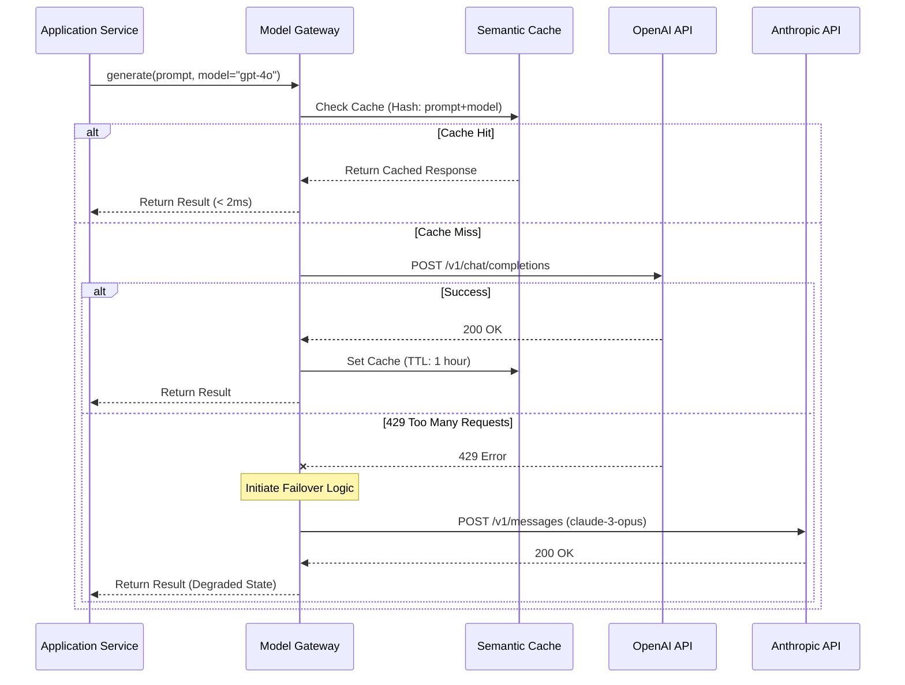
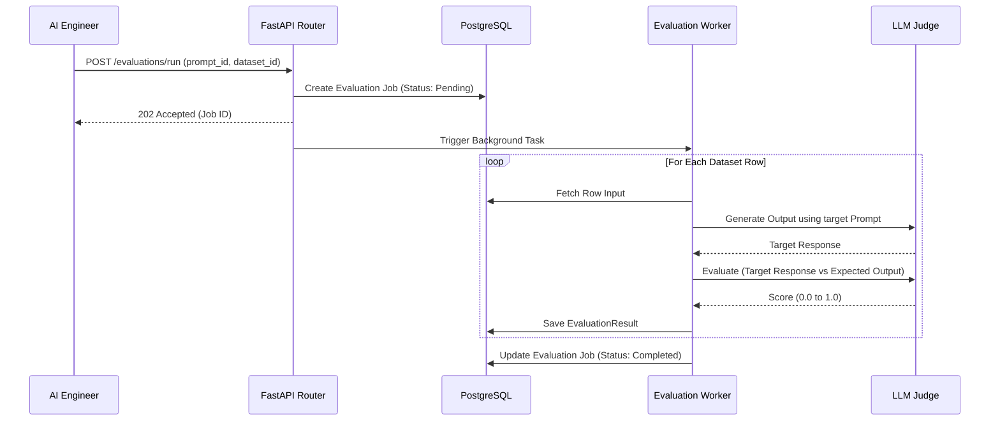

# Sequence Diagrams

This document illustrates the step-by-step sequential interactions between actors and system components for key workflows.

## 1. LLM Failover & Routing Workflow

This sequence demonstrates how the Model Gateway ensures high availability by automatically falling back to secondary models during primary outages.

## 2. Evaluation Framework Workflow

This sequence shows how asynchronous workers validate new prompt deployments against historical golden datasets.

