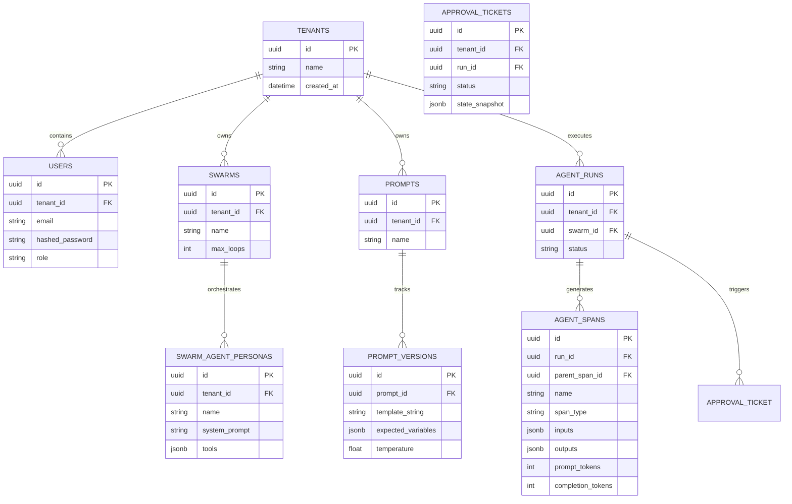

# Entity Relationship Diagram

This document provides the logical mapping of the core AIForge database schema.

```mermaid
erDiagram
    TENANTS {
        uuid id PK
        string name
        datetime created_at
    }
    
    USERS {
        uuid id PK
        uuid tenant_id FK
        string email
        string hashed_password
        string role
    }

    SWARMS {
        uuid id PK
        uuid tenant_id FK
        string name
        int max_loops
    }

    SWARM_AGENT_PERSONAS {
        uuid id PK
        uuid tenant_id FK
        string name
        string system_prompt
        jsonb tools
    }

    PROMPTS {
        uuid id PK
        uuid tenant_id FK
        string name
    }

    PROMPT_VERSIONS {
        uuid id PK
        uuid prompt_id FK
        string template_string
        jsonb expected_variables
        float temperature
    }

    AGENT_RUNS {
        uuid id PK
        uuid tenant_id FK
        uuid swarm_id FK
        string status
    }

    AGENT_SPANS {
        uuid id PK
        uuid run_id FK
        uuid parent_span_id FK
        string name
        string span_type
        jsonb inputs
        jsonb outputs
        int prompt_tokens
        int completion_tokens
    }

    APPROVAL_TICKETS {
        uuid id PK
        uuid tenant_id FK
        uuid run_id FK
        string status
        jsonb state_snapshot
    }

    TENANTS ||--o{ USERS : contains
    TENANTS ||--o{ SWARMS : owns
    TENANTS ||--o{ PROMPTS : owns
    TENANTS ||--o{ AGENT_RUNS : executes
    
    SWARMS ||--o{ SWARM_AGENT_PERSONAS : orchestrates
    PROMPTS ||--o{ PROMPT_VERSIONS : tracks
    AGENT_RUNS ||--o{ AGENT_SPANS : generates
    AGENT_RUNS ||--o{ APPROVAL_TICKET : triggers
```
