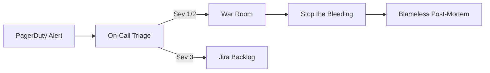

# Incident Response

This document outlines the high-level workflow for declaring and mitigating Sev-1 and Sev-2 incidents within AIForge.

## Severity Definitions

| Level | Definition | Example |
| :--- | :--- | :--- |
| **SEV-1** | Total system failure or active data breach. | Postgres goes down; OpenAI revokes our API key. |
| **SEV-2** | Significant degradation impacting core workflows. | 50% of Swarm invocations timeout; hitl approvals fail to resume. |
| **SEV-3** | Minor bug or localized degradation. | Telemetry takes 5 seconds to load in UI. |

## Incident Flow
1.  **Detection:** PagerDuty alerts the primary On-Call Engineer.
2.  **Triage:** On-Call assesses severity. If SEV-1, trigger a bridge call and page the Incident Commander.
3.  **Mitigation:** The primary goal is restoring service, NOT finding the root cause. (e.g., if OpenAI is failing, force traffic to Anthropic immediately).
4.  **Resolution:** Service returns to normal thresholds.
5.  **Post-Mortem:** A blameless Root Cause Analysis (RCA) document must be filed within 48 hours.

